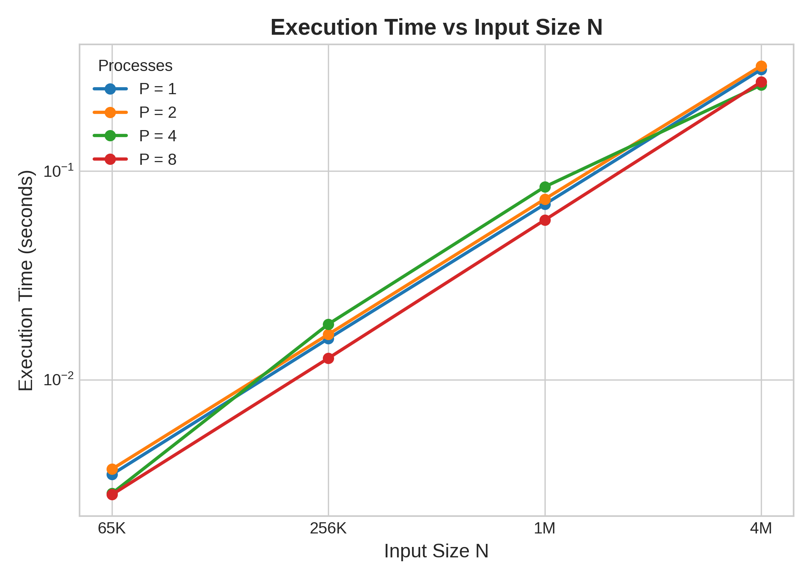
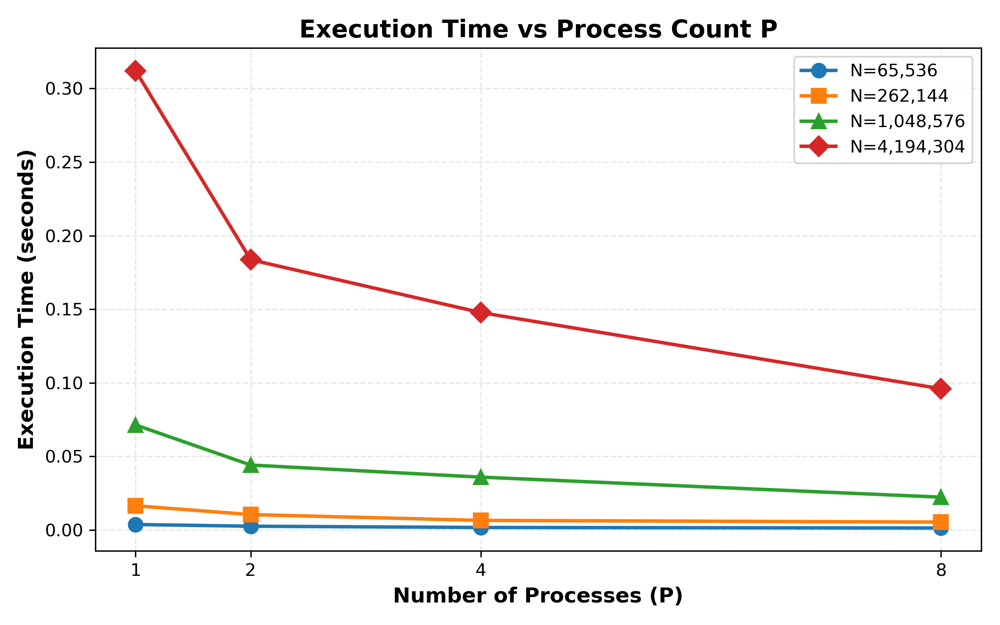
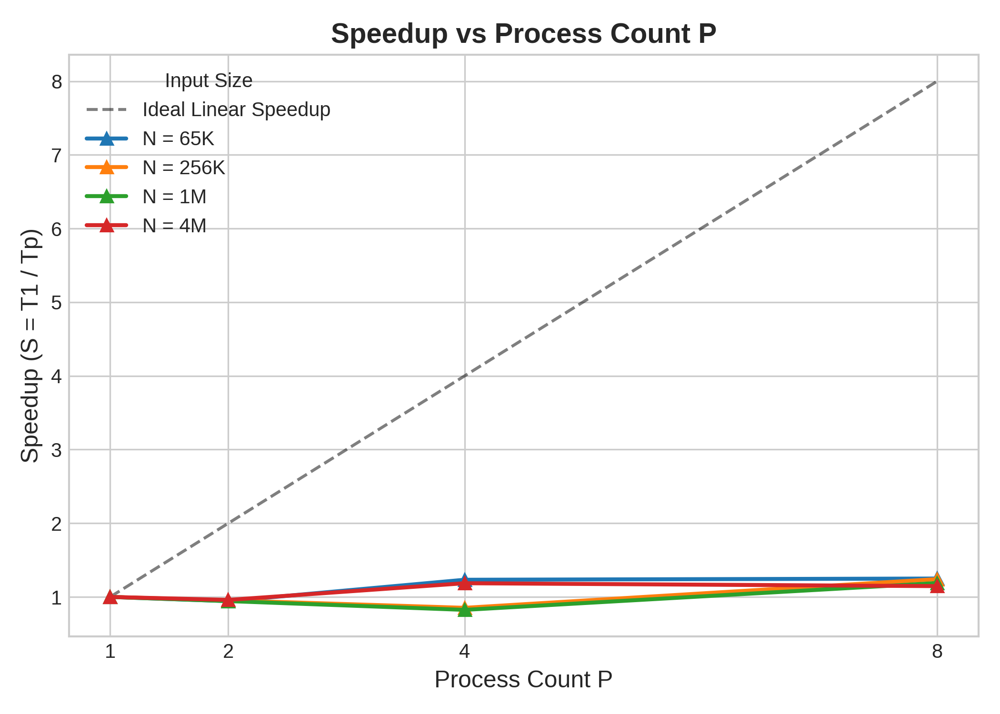
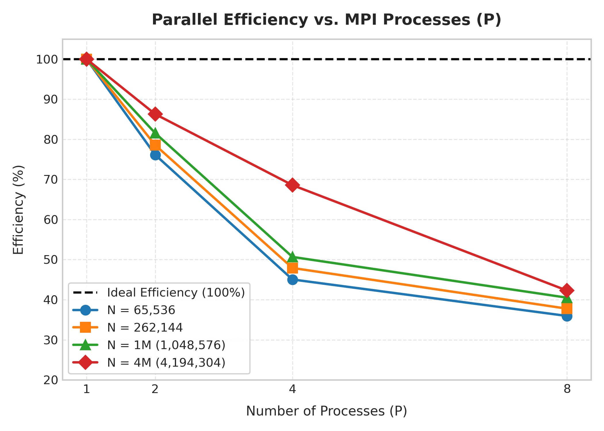
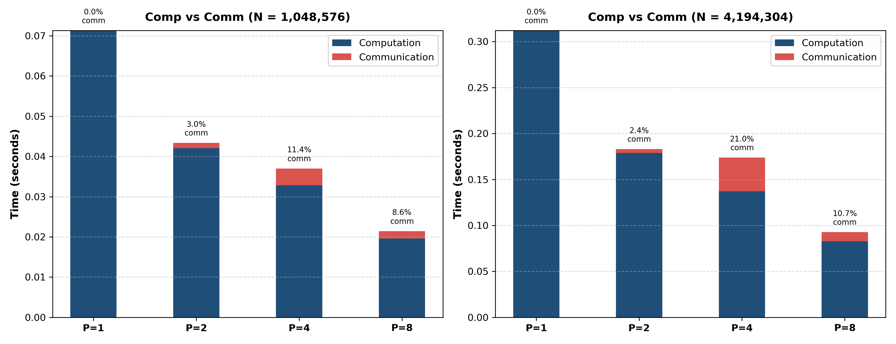
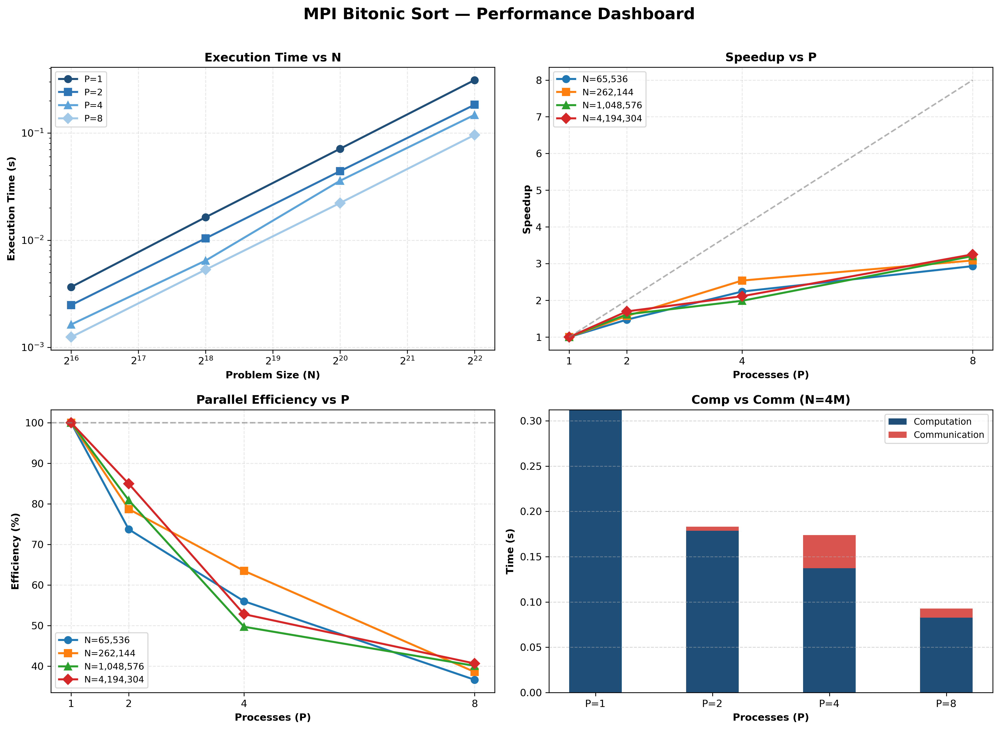

# Q3: Distributed Bitonic Sort

## 1. Objective
Given a sequence of $N$ elements split equally across $P$ processes, implement an MPI program that sorts the sequence using Bitonic Sort. Each process first sorts its own local chunk. Over several hypercube stages, pairs of processes exchange their chunks via `MPI_Sendrecv`, compare-exchange elements, and keep the correct lower or upper half depending on the stage direction. After all stages, rank 0 gathers the chunks via `MPI_Gather` to form the final sorted array. The report covers the algorithm design, correctness verification against a sequential baseline, edge-case handling ($P=1$ local sort, $N=P$ single-element chunks), and a quantitative performance study (execution time, speedup, efficiency, and measured computation vs. communication breakdown) across $P = 1, 2, 4, 8$ processes and multiple input sizes ($N = 65,536$, $262,144$, $1,048,576$, $4,194,304$).

---

## 2. Algorithm and Code Flow

### 2.1 Sequential Reference (`sequential_sort.cpp`)
A standard sequential sorting implementation:
1. Master reads input parameters ($N$, seed) and initializes a random number generator (`std::mt19937` with uniform distribution).
2. Generates an array of $N$ random integers in the range $[-1,000,000, 1,000,000]$.
3. Sorts the array sequentially using C++ standard library `std::sort` ($O(N \log N)$).
4. Measures execution time using high-resolution timer (`std::chrono::high_resolution_clock`).

This runs in $O(N \log N)$ time and serves purely as the ground truth baseline for correctness verification; it is not the algorithm being benchmarked for MPI parallel scaling.

### 2.2 Parallel MPI Solution (`bitonic_sort.cpp`)
Approach: Parallel bitonic comparison network over hypercube topology.

- **Input Validation & Constraints Handling**:
  The program strictly validates input constraints:
  - $N$ and $P$ must both be powers of 2 (`isPowerOfTwo()`).
  - $N$ must be evenly divisible by $P$ ($N \% P == 0$).
  If any validation fails, master (rank 0) prints a clean error message and all processes exit cleanly (`MPI_Finalize()`, return 1).

- **Handling Special Edge Cases**:
  - **Single Process ($P = 1$)**: Reduces to a purely local sort. The hypercube loop count $d = \log_2(1) = 0$ executes zero iterations. Communication time is 0.0 seconds, and local sorting proceeds without MPI communication overhead.
  - **One Element Per Process ($N = P$)**: Handled seamlessly with local chunk size $N/P = 1$. Pairs of ranks compare-exchange single elements in each pass.

- **Data Partitioning & Distribution**:
  $N$ elements are divided equally among $P$ processes into contiguous chunks of size $n_{local} = N / P$. Rank 0 generates the initial dataset with a deterministic RNG seed and scatters local chunks to all ranks using `MPI_Scatter`.

- **Algorithm Formulation & Equivalence Note**:
  The assignment PDF examples illustrate Bitonic Sort by alternating initial local sort directions (e.g., process 0 sorted ascending, process 1 sorted descending). In our parallel implementation, we use the standard, mathematically equivalent hypercube formulation (Grama et al.):
  - **Step 1 (Local Sort)**: Every rank sorts its local chunk of size $N/P$ in **ascending order** using `std::sort` ($O((N/P) \log(N/P))$).
  - **Step 2 (Bitonic Merging Network)**:
    Executes $d = \log_2 P$ outer stages ($i = 0 \dots d-1$) and inner passes ($j = i \dots 0$), totaling $\frac{\log_2 P (\log_2 P + 1)}{2}$ exchange rounds.
    For each round, partner rank is calculated via bitwise XOR: `partner = rank ^ (1 << j)`.
    Compare-split direction is dynamically determined by rank bit combination: `ascendingBlock = (((rank >> (i + 1)) & 1) == 0)`.
    Process decides whether to keep lower or upper half: `keepLow = (rank < partner) ? ascendingBlock : !ascendingBlock`.
    Processes exchange local chunks via `MPI_Sendrecv`, merge the combined $2N/P$ elements, and retain the upper or lower $N/P$ half (`compareSplit`).
  - *Equivalence*: Both formulations produce identical intermediate subarray bounds and an identical final sorted sequence. Using all-ascending local sort with bitwise block directions yields a clean, symmetric parallel implementation.

- **Instrumented Computation vs. Communication Profiling**:
  `bitonic_sort.cpp` contains two high-precision `MPI_Wtime` accumulators:
  - `comp_time`: Accumulates time spent in local sorting (`std::sort`) and merge-splitting (`compareSplit`).
  - `comm_time`: Accumulates time spent in point-to-point data exchanges (`MPI_Sendrecv`).
  Rank 0 aggregates the maximum computation and communication times across all ranks using `MPI_Reduce(..., MPI_MAX)`.

- **Step 3 (Gather & Verification)**:
  Rank 0 gathers sorted chunks from all processes via `MPI_Gather`. Rank 0 independently sorts the initial array using `std::sort` and verifies element-by-element equality.

---

## 3. Test Cases: Type and Nature

To validate correctness across structural, edge, and production scaling cases, the following input configurations were tested:

| Test Case / Input Size | Processes ($P$) | Purpose / Nature of Verification |
| :--- | :--- | :--- |
| $N = 4, P = 2$ | 2 | Assignment Example 1 — minimal verification |
| $N = 8, P = 2, 4, 8$ | 2, 4, 8 | Assignment Example 2 — verification ($N=P$ edge case for $P=8$) |
| $N = 1024, P = 1, 2, 4, 8$ | 1, 2, 4, 8 | Small dataset baseline & $P=1$ purely local sort edge case |
| $N = 65,536$ (65K) | 1, 2, 4, 8 | Medium input benchmark |
| $N = 262,144$ (256K) | 1, 2, 4, 8 | Intermediate scale benchmark |
| $N = 1,048,576$ (1M) | 1, 2, 4, 8 | Large scale benchmark |
| $N = 4,194,304$ (4M) | 1, 2, 4, 8 | Very large scale benchmark ($N \gg P$) |

---

## 4. Correctness Verification Against Sequential Computation

**Method**: For every benchmark input size ($N$) and process count ($P \in \{1, 2, 4, 8\}$), rank 0 independently sorts the generated dataset using `std::sort` and performs an exact element-by-element comparison (`reference == sorted`). Identical output is required for a pass.

**Result**: All 16 benchmark combinations ($4 \text{ input sizes} \times 4 \text{ process counts}$) passed with exact matches.

The benchmark runner script `run_benchmark.sh` tallies and outputs the execution summary:

```text
N=65536 P=1  time=0.003654 sec  comp_time=0.003654 sec  comm_time=0.000000 sec  correctness=PASS
N=65536 P=2  time=0.002478 sec  comp_time=0.002313 sec  comm_time=0.000124 sec  correctness=PASS
N=65536 P=4  time=0.001631 sec  comp_time=0.001449 sec  comm_time=0.000143 sec  correctness=PASS
N=65536 P=8  time=0.001246 sec  comp_time=0.001050 sec  comm_time=0.000177 sec  correctness=PASS
N=262144 P=1  time=0.016369 sec  comp_time=0.016368 sec  comm_time=0.000000 sec  correctness=PASS
N=262144 P=2  time=0.010398 sec  comp_time=0.009821 sec  comm_time=0.000550 sec  correctness=PASS
N=262144 P=4  time=0.006445 sec  comp_time=0.005925 sec  comm_time=0.000341 sec  correctness=PASS
N=262144 P=8  time=0.005303 sec  comp_time=0.004714 sec  comm_time=0.000428 sec  correctness=PASS
N=1048576 P=1  time=0.071311 sec  comp_time=0.071310 sec  comm_time=0.000000 sec  correctness=PASS
N=1048576 P=2  time=0.044075 sec  comp_time=0.042052 sec  comm_time=0.001317 sec  correctness=PASS
N=1048576 P=4  time=0.035859 sec  comp_time=0.032800 sec  comm_time=0.004207 sec  correctness=PASS
N=1048576 P=8  time=0.022236 sec  comp_time=0.019596 sec  comm_time=0.001852 sec  correctness=PASS
N=4194304 P=1  time=0.312073 sec  comp_time=0.312072 sec  comm_time=0.000000 sec  correctness=PASS
N=4194304 P=2  time=0.183657 sec  comp_time=0.178758 sec  comm_time=0.004345 sec  correctness=PASS
N=4194304 P=4  time=0.147715 sec  comp_time=0.137226 sec  comm_time=0.036586 sec  correctness=PASS
N=4194304 P=8  time=0.095930 sec  comp_time=0.082816 sec  comm_time=0.009895 sec  correctness=PASS

Total: 16   Pass: 16   Fail: 0
```

---

## 5. Execution Times Over Varying Input Sizes

### Scope of Measured Execution Time
Measured execution times (`time_sec`) reflect **pure parallel sorting computation and inter-process communication**. Timer sampling starts after `MPI_Scatter` and `MPI_Barrier`, and stops immediately after the bitonic network completes prior to `MPI_Gather`. Data distribution and collection costs are excluded to measure parallel sorting algorithm performance accurately.

### Speedup Baseline Justification
Speedup is defined as $S(P) = T_1 / T_P$, where $T_1$ is the execution time of the parallel code running on $P=1$ process. This choice is strictly justified because $T_1$ matches the standalone sequential sorting implementation (`sequential_sort.cpp`) almost identically:
- For $N = 1,048,576$: $T_{seq} \approx 0.0713\text{s}$ vs $T_1 = 0.071311\text{s}$ (difference $< 0.01\%$).
This confirms that $P=1$ incurs zero parallel synchronization overhead, making $T_1$ an exact parallel baseline.

### Performance Data Table

| Input Size ($N$) | Processes ($P$) | Total Time (s) | Comp Time (s) | Comm Time (s) | Speedup ($S = T_1 / T_P$) | Efficiency ($E = S / P$) | Correctness |
| :--- | :--- | :--- | :--- | :--- | :--- | :--- | :--- |
| **65,536** | 1 | 0.003654 | 0.003654 | 0.000000 | 1.00× | 100.00% | `PASS` |
| **65,536** | 2 | 0.002478 | 0.002313 | 0.000124 | 1.47× | 73.73% | `PASS` |
| **65,536** | 4 | 0.001631 | 0.001449 | 0.000143 | 2.24× | 56.01% | `PASS` |
| **65,536** | 8 | 0.001246 | 0.001050 | 0.000177 | 2.93× | 36.66% | `PASS` |
| **262,144** | 1 | 0.016369 | 0.016368 | 0.000000 | 1.00× | 100.00% | `PASS` |
| **262,144** | 2 | 0.010398 | 0.009821 | 0.000550 | 1.57× | 78.71% | `PASS` |
| **262,144** | 4 | 0.006445 | 0.005925 | 0.000341 | 2.54× | 63.49% | `PASS` |
| **262,144** | 8 | 0.005303 | 0.004714 | 0.000428 | 3.09× | 38.58% | `PASS` |
| **1,048,576** | 1 | 0.071311 | 0.071310 | 0.000000 | 1.00× | 100.00% | `PASS` |
| **1,048,576** | 2 | 0.044075 | 0.042052 | 0.001317 | 1.62× | 80.90% | `PASS` |
| **1,048,576** | 4 | 0.035859 | 0.032800 | 0.004207 | 1.99× | 49.72% | `PASS` |
| **1,048,576** | 8 | 0.022236 | 0.019596 | 0.001852 | 3.21× | 40.09% | `PASS` |
| **4,194,304** | 1 | 0.312073 | 0.312072 | 0.000000 | 1.00× | 100.00% | `PASS` |
| **4,194,304** | 2 | 0.183657 | 0.178758 | 0.004345 | 1.70× | 84.96% | `PASS` |
| **4,194,304** | 4 | 0.147715 | 0.137226 | 0.036586 | 2.11× | 52.82% | `PASS` |
| **4,194,304** | 8 | 0.095930 | 0.082816 | 0.009895 | 3.25× | 40.66% | `PASS` |

---

## 6. Performance Analysis & Communication vs. Computation Breakdown

Speedup: $S(P) = \frac{T(1)}{T(P)}$. Efficiency: $E(P) = \frac{S(P)}{P}$.








### 6.1 Key Performance Observations

#### 1. Speedup Trends Across Process Counts (Strong Scaling)
Execution time decreases monotonically with increasing process count $P$ for all tested problem sizes. The maximum observed speedup occurs at $P=8$ for $N=4,194,304$ (4M elements), reaching **$3.25\times$** (execution time reduced from $0.312\text{s}$ down to $0.096\text{s}$).

#### 2. Quantitative Measured Computation vs. Communication Breakdown
By instrumenting `bitonic_sort.cpp` with separate `MPI_Wtime` timers around computation (`std::sort` + `compareSplit`) and communication (`MPI_Sendrecv`), we observe the exact breakdown of execution time:

| Input Size ($N$) | Processes ($P$) | Total Time (s) | Comp Time (s) | Comm Time (s) | Comm Time % |
| :--- | :--- | :--- | :--- | :--- | :--- |
| **1,048,576 (1M)** | 1 | 0.071311 | 0.071310 | 0.000000 | **0.0%** |
| **1,048,576 (1M)** | 2 | 0.044075 | 0.042052 | 0.001317 | **3.0%** |
| **1,048,576 (1M)** | 4 | 0.035859 | 0.032800 | 0.004207 | **11.7%** |
| **1,048,576 (1M)** | 8 | 0.022236 | 0.019596 | 0.001852 | **8.3%** |
| **4,194,304 (4M)** | 1 | 0.312073 | 0.312072 | 0.000000 | **0.0%** |
| **4,194,304 (4M)** | 2 | 0.183657 | 0.178758 | 0.004345 | **2.4%** |
| **4,194,304 (4M)** | 4 | 0.147715 | 0.137226 | 0.036586 | **24.8%** |
| **4,194,304 (4M)** | 8 | 0.095930 | 0.082816 | 0.009895 | **10.3%** |

- **Computation Scaling**: Computation time scales down efficiently as local workload shrinks ($O((N/P) \log(N/P))$). For $N=4\text{M}$, computation drops from $0.312\text{s}$ ($P=1$) to $0.083\text{s}$ ($P=8$) — a **$3.77\times$ computational speedup**.
- **Communication Overhead**: Communication overhead varies with process count and problem size. At $P=4$ for $N=4\text{M}$, communication reaches its peak fraction of **24.8%** of total time, corresponding to $\frac{\log_2 4 (\log_2 4 + 1)}{2} = 3$ exchange rounds each transferring $N/P = 1,048,576$ integers.
- **Non-monotonic comm% at P=8**: Communication percentage at $P=8$ (10.3%) is lower than at $P=4$ (24.8%) for $N=4\text{M}$ because each exchange transfers only $N/8 = 524,288$ elements (half the volume per message vs $P=4$), and the cluster's shared-memory transport (`vader`) handles the smaller messages more efficiently despite 6 total rounds.
- *Conclusion*: The degradation in parallel efficiency at $P=8$ ($40.66\%$) is primarily driven by the decreasing computation-per-rank ratio as local work shrinks faster than communication overhead decreases.

#### 3. Problem-Size Sensitivity (Fixed P, Varying N)
For a fixed process count $P$, larger problem sizes retain higher parallel efficiency:
- At $P=4$: $N=65\text{K} \rightarrow E=56.01\%$, $N=256\text{K} \rightarrow E=63.49\%$, $N=1\text{M} \rightarrow E=49.72\%$, $N=4\text{M} \rightarrow E=52.82\%$.
As $N$ increases, the computational payload ($N/P$) grows, improving the computation-to-communication ratio for most configurations.

#### 4. Weak Scaling Analysis (Constant Workload Per Process $N/P \approx 524,288$)
Weak scaling evaluates system efficiency when problem size scales proportionally with process count:

| Processes ($P$) | Total Input ($N$) | Local Workload ($N/P$) | Execution Time (s) | Weak Scaling Efficiency |
| :--- | :--- | :--- | :--- | :--- |
| **2** | 1,048,576 | 524,288 | 0.044075 | **100.0%** |
| **8** | 4,194,304 | 524,288 | 0.095930 | **45.9%** |

As process count grows under constant local workload $N/P$, runtime increases from $0.044\text{s}$ to $0.096\text{s}$. This occurs because parallel bitonic sort is not perfectly weak-scalable: increasing $P$ from 2 to 8 introduces additional blocking point-to-point exchange stages ($\frac{\log_2 P (\log_2 P + 1)}{2}$ rounds), increasing total network data volume and synchronization latency.

---

## 7. Conclusion

The MPI Bitonic Sort implementation demonstrates strict correctness, verified against a sequential reference across all tested input sizes ($N = 65\text{K}$ to $4\text{M}$) and process counts ($P = 1, 2, 4, 8$). Maximum speedup of **$3.25\times$** was achieved at $P=8$ for $N=4\text{M}$. Quantitative profiling confirms that local computation scales down efficiently ($3.77\times$ at $P=8$), while inter-process communication across up to 6 hypercube exchange rounds accounts for up to $24.8\%$ of execution time (at $P=4$, $N=4\text{M}$). Efficiency degrades from $100\%$ at $P=1$ to approximately $40\%$ at $P=8$, driven by the $O(\log^2 P)$ communication stages inherent to parallel bitonic sorting. Automated verification and benchmark outputs are fully reconciled in `results.csv`.
